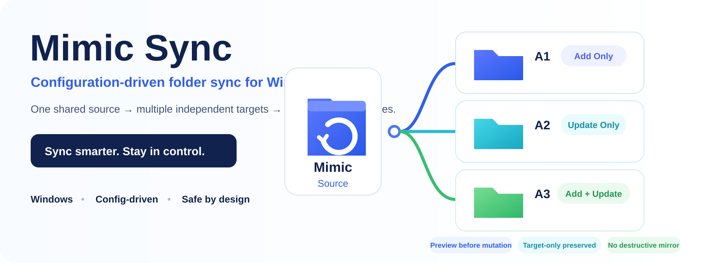
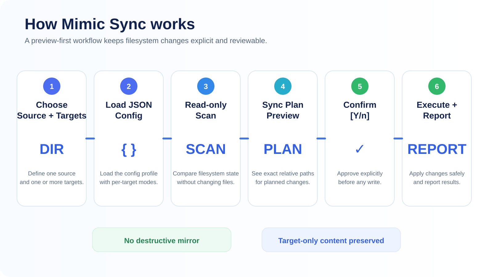
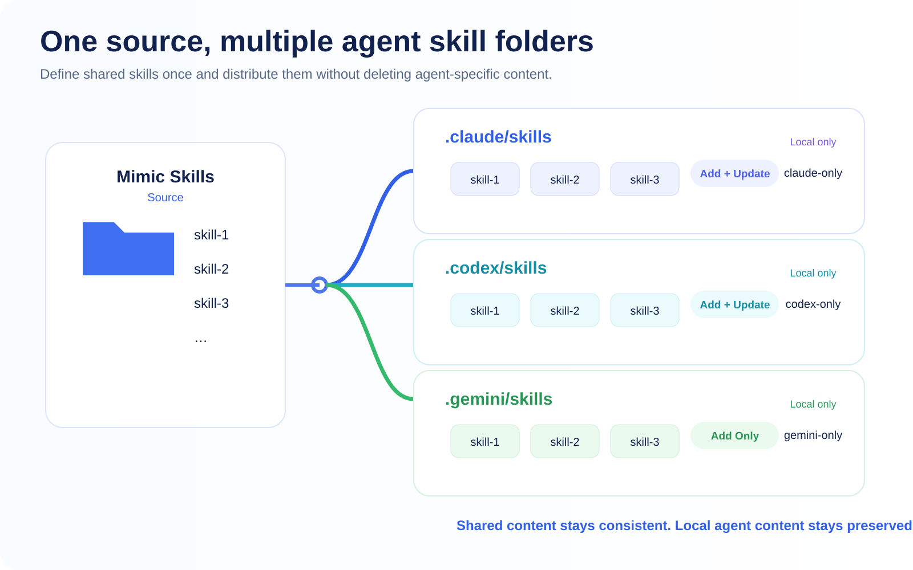

<p align="center">
  
</p>

<h1 align="center">Mimic Sync</h1>

<p align="center">
  <strong>Configuration-driven folder sync for Windows.</strong><br>
  Distribute shared content from one source to multiple targets with per-target policies — while preserving target-only files.
</p>

<p align="center">
  Windows · PowerShell · Config-driven · Safe by design · MIT
</p>

<p align="center">
  <strong>V1 Released / Release Verified</strong>
</p>

---

## Why Mimic Sync?

Shared folders are easy to copy once. They become harder to maintain when the same baseline content must stay available across several independent workspaces — especially when each destination also contains local files that must not be treated as disposable.

Mimic Sync solves that narrow problem with a one-way, preview-first model:

```text
one Source / Mimic folder
        ↓
multiple independent Targets
        ↓
per-target sync policy
```

It is intentionally **not** a destructive mirror. Content that exists only in a Target remains outside the V1 managed scope and is preserved.

Typical uses include shared templates, reusable scripts, common configuration, reference assets, workspace resources, and AI-agent skill folders.

---

## Verified on real Windows runs

Mimic Sync's public claims are backed by the repository's release verification rather than by a mock demo.

| Evidence | Result |
|---|---:|
| Manual acceptance on Windows | **PASS** |
| Baseline automated verification | **42 / 42 PASS** |
| Expanded hardening verification | **63 / 63 PASS** |
| Browser Configurator manual QA | **PASS** |

The verification suite covers the three sync policies, repeat-run idempotency, cancellation before writes, target-only preservation, spaces and Unicode paths, duplicate/overlapping targets, unsafe path relationships, file/directory collisions, locked-file failures, temporary-file cleanup, and Junction/reparse-point boundaries.

Run the fixture suite yourself:

```powershell
.\tests\run-tests.ps1
```

---

## Three sync modes

Every Target chooses its own policy. A single profile can mix all three modes.

| Target state | Add Only | Update Only | Add + Update |
|---|---:|---:|---:|
| Source item is missing in Target | **ADD** | Skip | **ADD** |
| Source and Target are identical | Skip | Skip | Skip |
| Same path exists but content differs | Skip | **UPDATE** | **UPDATE** |
| Item exists only in Target | Preserve | Preserve | Preserve |

### Add Only

Fill gaps without overwriting anything that already exists in the Target.

### Update Only

Refresh an already-approved subset without introducing new Source items.

### Add + Update

Keep shared content present and current while still preserving Target-only content.

---

## How it works

<p align="center">
  
</p>

The execution boundary is deliberate:

1. **Configure** one Source and one or more Targets in JSON or with the browser Configurator.
2. **Scan read-only** and compare real filesystem state.
3. **Preview the Sync Plan** with exact relative paths before mutation.
4. **Confirm with `Y/n`**. Answering `n` exits without writes.
5. **Execute and report** the successful adds, updates, directory creation, and any failures per Target.

The browser Configurator defines intent. The PowerShell CLI remains the only V1 component that scans and mutates the filesystem.

---

## Use case: one shared skill source, multiple AI agents

A practical use case is maintaining a common set of reusable skills across multiple agent environments without deleting agent-specific skills.

<p align="center">
  
</p>

> **Illustrated use case:** the image explains the synchronization relationship; it is not presented as a screenshot of the CLI.

For example, one profile can define:

```text
Mimic Skills
├── skill-1
├── skill-2
└── skill-3

        ├──→ .claude/skills   Add + Update
        ├──→ .codex/skills    Add + Update
        └──→ .gemini/skills   Add Only
```

Each destination can still retain its own local-only content because V1 never interprets Target-only files as deletion candidates.

The same engine is domain-neutral: substitute project templates, scripts, configs, or any other repeated folder content and the synchronization model stays the same.

---

## Quick Start

### 1. Prepare a config

Copy the tracked example:

```text
config.example.json
```

as:

```text
mimic-sync.config.json
```

Then define your Source, Targets, and policy for each Target:

```json
{
  "source": "D:\\Shared\\Mimic",
  "targets": [
    {
      "name": "Project Alpha",
      "path": "D:\\Projects\\Alpha",
      "mode": "add-update"
    },
    {
      "name": "Project Beta",
      "path": "D:\\Projects\\Beta",
      "mode": "add-only"
    },
    {
      "name": "Project Gamma",
      "path": "D:\\Projects\\Gamma",
      "mode": "update-only"
    }
  ]
}
```

In V1, the Source and Target root folders must already exist. Relative paths are resolved from the config file directory, and Windows environment variables in configured paths are expanded by the CLI.

### 2. Run

From PowerShell:

```powershell
powershell.exe -NoProfile -ExecutionPolicy Bypass -File ".\mimic-sync.ps1" -Config ".\mimic-sync.config.json"
```

Or double-click:

```text
Mimic Sync.bat
```

You can also drag a JSON profile onto `Mimic Sync.bat`. If no default profile exists, the launcher explains the available options instead of failing silently.

### 3. Review before approving

A real run pauses at the Sync Plan:

```text
Target: Project Alpha
Mode: add-update

  [ADD]    templates\new-template.md
  [UPDATE] shared-config\settings.json
  [MKDIR]  scripts\helpers

Proceed with sync? [Y/n]
```

Press `Y` or Enter to proceed. Press `n` to exit with no writes.

---

## Browser Configurator

Open [`configurator/index.html`](configurator/index.html) locally when you prefer a visual way to build the JSON profile.

It supports:

- Source path entry;
- dynamic Target add/remove;
- independent mode selection per Target;
- configuration summary;
- JSON export;
- ready-to-copy CLI command;
- plain-language parameter guidance.

The Configurator does **not** claim to know actual ADD/UPDATE actions. Only the CLI can derive the real Sync Plan from the filesystem.

---

## Engineering decisions behind the safety model

Mimic Sync is small, but the release focuses heavily on predictable filesystem behavior.

- **Content-based comparison** — file size plus SHA-256 determines `SAME` vs `DIFFERENT`; timestamps alone are not authoritative.
- **Preview-before-mutation** — no planned write executes until the user confirms the derived Sync Plan.
- **Execution-time drift checks** — the engine revalidates Source/Target state before planned writes and refuses a blind overwrite when the Target changed after preview.
- **Staged writes and cleanup** — ADD operations use temporary staging; UPDATE failures use best-effort rollback and cleanup behavior.
- **Path safety** — identical, nested, overlapping, and reparse-point-routed Source/Target relationships are rejected when unsafe.
- **Target ownership** — absence from the Source never becomes an automatic delete instruction in V1.

For the deeper contracts, see [Architecture](docs/architecture.md) and the authoritative [Sync Model](docs/sync-model.md).

---

## V1 boundaries

Mimic Sync V1 is intentionally narrow. It does **not** implement:

- automatic deletion or purge;
- full mirror synchronization;
- bidirectional sync;
- automatic conflict merging;
- historical managed/stale/exclusive classification;
- rename detection;
- background filesystem watching;
- Directory Junction or symbolic-link distribution;
- cloud synchronization;
- EXE / Electron / Tauri packaging;
- direct filesystem mutation from the Web Configurator.

These exclusions are part of the safety contract rather than unfinished hidden behavior.

### V2 direction

A future state-aware version may introduce `.mimic-state.json` so Mimic Sync can distinguish historically managed content from truly local-exclusive content and surface **possible rename** cases without unsafe guessing.

Shared-reference / Junction distribution remains a separate future architecture because its ownership and failure semantics differ from replication.

---

## Repository map

```text
mimic-sync/
├── mimic-sync.ps1            # execution engine
├── Mimic Sync.bat            # one-click launcher
├── config.example.json       # tracked configuration example
├── configurator/index.html   # browser-based profile builder
├── examples/                 # generic + agent-skill profiles
├── tests/                    # fixture integration / hardening suite
├── docs/
│   ├── architecture.md
│   ├── sync-model.md
│   └── roadmap.md
└── assets/readme/            # README presentation assets
```

---

## Documentation

- [Architecture](docs/architecture.md) — component boundaries and V1 architecture
- [Sync Model](docs/sync-model.md) — authoritative policy/state behavior
- [Roadmap](docs/roadmap.md) — V1 lifecycle closure and future directions
- [Generic folder example](examples/generic-folder-sync.json)
- [AI-agent skills example](examples/agent-skills-sync.json)

---

## Release status

**Mimic Sync V1 is Released / Release Verified.**

The V1 feature set is frozen. Manual acceptance, baseline verification, expanded hardening, Configurator QA, and remote release-commit verification are complete. Future feature work belongs in V2/Future unless a release-blocking V1 defect is discovered.

---

## License

MIT — see [LICENSE](LICENSE).
